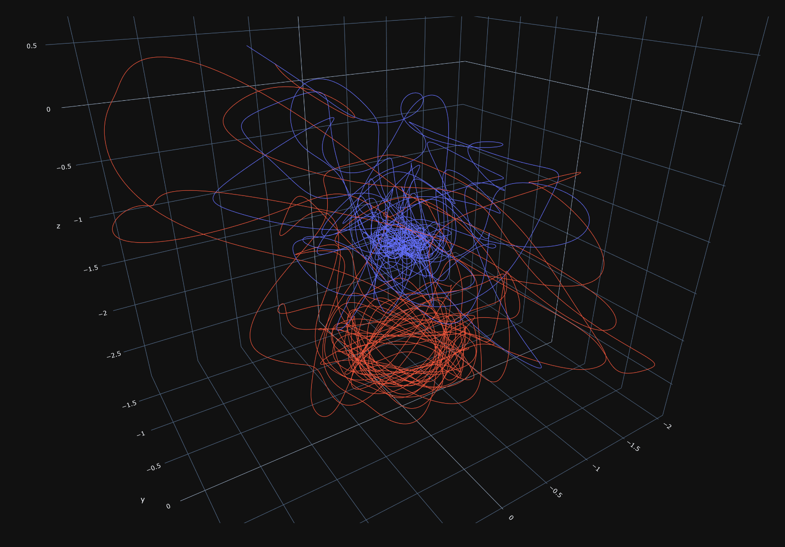

<p align="center">
  
</p>

# Modeller

Multibody simulation playground that utilizes Simbody for dynamics. Wrappers for Pybind11, SPICE, and MarsGRAM (with more to come!). Utilizes Docker, CMake, and Miniconda. 

## Prerequisites

* Docker

## Clone and Create Docker Image

Clone this repository:

```
git clone https://github.com/jasonmeverett/modeller.git
```

Initialize the repository submodules and build the Docker image:

```
cd ./modeller
git submodule update --init
docker build -t modeller-dev:1.0 .
```

## Developing and Running the Simulation Suite

My typical workflow involves Visual Studio Code (see the `.devcontainer/` and `.vscode/` directories), but it is also possible to just work in the image directly. For development purposes, if using VS Code, open this directory as a folder in Code and open up the command pallette (`Ctrl-Shift-P`) and select `Rebuild and Reopen in Container`. This will automatically bind-mount this repository.

The development image also comes with X11 support and small IDE's, so if it's desired, one can also run the image with:

```
docker run -e DISPLAY -ti -p 8080:8080 modeller-dev:1.0 /bin/bash
```

Passing your `DISPLAY` variable is only necessary if you plan on running any sort of visualization.

<p align="center">
  
</p>


